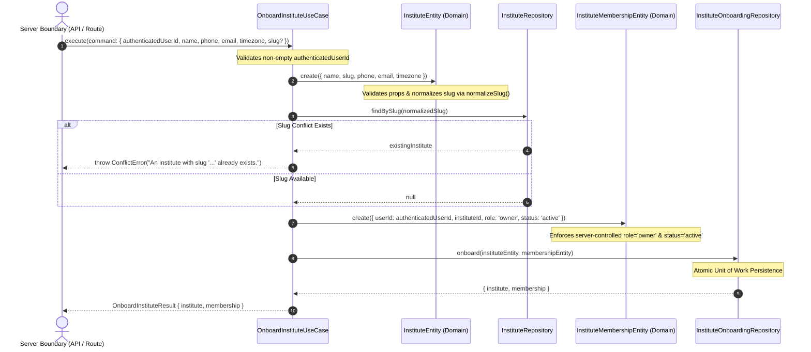
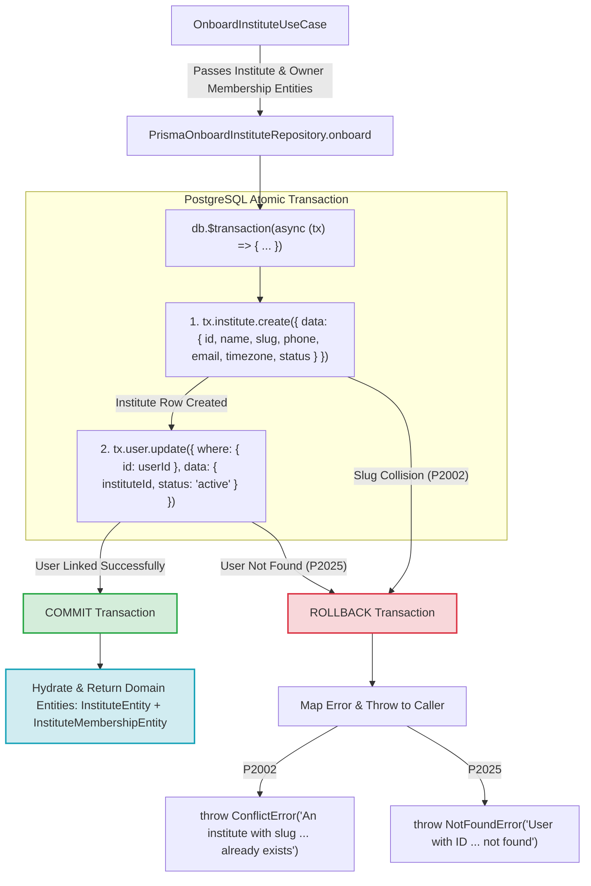

# Phase 1.4 — Institute Onboarding Workflow Architecture Contract

**Status:** Architecture Freeze 🟢  
**Milestone:** Phase 1.4.0 — Architecture & Workflow Contract  
**Target:** Define the authoritative, atomic, and secure first-time user onboarding journey for CoachingOS, transforming an authenticated user into the active owner of a new institute tenant.

---

## 1. Executive Summary & Objective

Phase 1.4 establishes the **Institute Onboarding Workflow**. It defines the atomic transition when a newly authenticated user (`User.id` exists, but zero active tenant memberships exist) creates their first coaching institute and bootstraps their initial `owner` membership.

### Core Architecture Principles:
1. **Atomic Tenant Bootstrap**: Creating the `Institute` and creating the initial `owner` `InstituteMembership` MUST occur within a single atomic database transaction. If either operation fails, the transaction rolls back completely.
2. **Framework-Independent Domain**: The onboarding use case (`OnboardInstituteUseCase`) encapsulates orchestration and validation without importing Next.js, React, or HTTP primitives.
3. **Derived Onboarding State**: Onboarding status is derived dynamically from existing `User` and `InstituteMembership` relationships. No dedicated `onboarding_states` table or speculative progress tracking schema is introduced.
4. **Narrow Bootstrap Authorization Exemption**: Initial institute creation does not require a pre-existing `TenantContext` (since no tenant exists yet). It requires an authenticated user identity (`userId`). Upon atomic commit, `ResolveInstituteMembershipUseCase` immediately produces the trusted `TenantContext`.
5. **Multi-Tenant Compatibility**: While the default onboarding UX caters to single-tenant founders, the underlying domain logic and schema preserve full multi-tenant compatibility (`User` ↔ `InstituteMembership` ↔ `Institute`).

---

## 2. Problem Definition & Canonical User Journey

### First-Time Founder User Flow:

```text
[Anonymous Visitor]
        │
        ▼
 (Sign Up via Better Auth: OAuth / Email / Magic Link)
        │
        ▼
 [Authenticated User (User.id created)]
        │
        ▼ (App Router Middleware / Layout Guard)
 Check: Does user have active InstituteMembership?
        │
        ├── YES ──► Redirect to /dashboard
        │
        └── NO ───► Redirect to /onboarding
                       │
                       ▼
             (Fills Institute Form)
                       │
                       ▼
         POST /api/onboarding/institute
                       │
                       ▼
       OnboardInstituteUseCase.execute()
                       │
                       ▼ (Atomic Transaction)
     ┌─────────────────┴─────────────────┐
     │ 1. Create Institute Entity        │
     │ 2. Create Owner Membership Entity │
     └─────────────────┬─────────────────┘
                       │
                       ▼ (Success)
       ResolveInstituteMembershipUseCase
                       │
                       ▼
     Trusted TenantContext Established
                       │
                       ▼
             Redirect to /dashboard
```

---

## 3. Canonical Onboarding State Machine

The onboarding state is **derived dynamically** at runtime based on the user's session and membership query:

```text
┌────────────────────────┐
│   UNAUTHENTICATED      │ No active session cookie.
└───────────┬────────────┘
            │ Log In / Sign Up
            ▼
┌────────────────────────┐
│ AUTHENTICATED_NO_TENANT│ Session valid, 0 active memberships.
└───────────┬────────────┘
            │ Submits Onboarding Form
            ▼
┌────────────────────────┐
│ ONBOARDING_IN_PROGRESS │ Transient state during atomic DB transaction.
└───────────┬────────────┘
            │ Atomic Commit (Institute + Owner Membership)
            ▼
┌────────────────────────┐
│  TENANT_MEMBER /       │ Active owner membership exists.
│  ONBOARDED             │ ResolveInstituteMembership returns TenantContext.
└────────────────────────┘
```

---

## 4. User ↔ Institute Relationship Invariants

1. **Multi-Tenancy**: A single `User` record may belong to multiple institutes via distinct `InstituteMembership` records.
2. **Multi-Ownership**: An `Institute` can have multiple `owner` memberships (for co-founders), but onboarding creates the **initial primary owner**.
3. **Owner Obligation**: An `Institute` MUST NOT exist without at least one active `owner` membership.
4. **Slug Immutability**: The institute `slug` is generated/customized during onboarding and is **100% immutable** after creation.
5. **No Orphaned Tenants**: Partial onboarding failure MUST roll back completely. An institute cannot exist in the database without its associated owner membership.

---

## 5. Owner Bootstrap Semantics & Atomic Transaction Strategy

### Unit of Work:
Institute creation and owner membership assignment form a strict **Atomic Unit of Work**.

```text
BEGIN TRANSACTION

  1. Create Institute record (id, name, slug, phone, email, status='active')
  2. Create InstituteMembership record (id, userId, instituteId, role='owner', status='active')
  3. (Optional) Set User.instituteId = created.id (for primary staff link)

COMMIT
```

If any step throws an error (e.g., duplicate slug, database disconnect, payload invalidity), the entire transaction rolls back (`ROLLBACK`).

### Infrastructure Abstraction:
To preserve domain layer framework-independence:
- The domain defines an `OnboardInstituteRepository` interface or transactional unit of work contract.
- The infrastructure layer implements `PrismaOnboardInstituteRepository` using Prisma 7 `$transaction` (`tx.institute.create`, `tx.instituteMembership.create`).

---

## 6. Idempotency & Conflict Handling

1. **Duplicate Slug Conflict**: If the requested slug already exists in `Institute`, the transaction fails fast before mutation with `ConflictError("An institute with slug '...' already exists.")`.
2. **Duplicate Onboarding Submission**: If a user submits the form twice (double click / network retry):
   - The first request commits atomically.
   - The second request either fails fast with `ConflictError` or `GetUserMembershipsUseCase` detects the active membership created by the first request and returns the existing `TenantContext`.
3. **Database Uniqueness Guards**:
   - `institutes.slug` `@unique`
   - `institute_memberships.parent_identity_id + institute_id` `@unique`
   - `institute_parents.primary_phone + institute_id` `@unique`

---

## 7. Slug Generation & Rules

- **Generation**: Slug is generated from the institute name via `normalizeSlug(name)` (e.g., `"Sharma Physics Classes"` → `"sharma-physics-classes"`).
- **Customization**: Option for user to specify a custom slug during onboarding, validated by `slugSchema`.
- **Immutability Invariant**: Preserves Phase 1.1 invariant: Slug cannot be edited after initial onboarding.
- **Reserved Slugs**: Slugs such as `admin`, `api`, `app`, `auth`, `dashboard`, `onboarding`, `settings`, `support`, `billing` are reserved and rejected during validation.

---

## 8. Authorization Model & Bootstrap Exception

- **Standard RBAC (Phase 1.3)**: Requires an active `TenantContext` and `institute:update` capability.
- **Onboarding Bootstrap Exception**:
  - `OnboardInstituteUseCase` does NOT require a pre-existing `TenantContext`.
  - `OnboardInstituteUseCase` requires a valid **authenticated user ID** (`userId`).
  - Upon successful transaction commit, `ResolveInstituteMembershipUseCase` immediately resolves the new `TenantContext`.
- **Security Guard**: `OnboardInstituteUseCase` checks if the user is already an active member of an institute (or if multi-tenant onboarding is enabled for that actor), preventing unauthorized tenant spamming.

---

## 9. Trust Boundaries & Server Scoping

| Input / Attribute | Source of Truth | Trust Boundary |
| :--- | :--- | :--- |
| `name`, `phone`, `email`, `timezone` | Client Request Payload | Client-Controlled (Zod Validated) |
| `slug` | Client Payload or Auto-Generated | Client-Provided / Server-Normalized |
| `creatorUserId` | Authenticated Session Cookie | **Server-Controlled** |
| `role` | Hardcoded `'owner'` | **Server-Controlled** |
| `status` | Hardcoded `'active'` | **Server-Controlled** |
| `instituteId` | `crypto.randomUUID()` | **Server-Controlled** |
| `membershipId` | `crypto.randomUUID()` | **Server-Controlled** |
| `tenantContext` | `ResolveInstituteMembershipUseCase` | **Server-Controlled** |

---

## 10. Validation Rules & Schemas

Onboarding commands are validated using Zod presentation schemas in `@coaching-os/identity`:

```ts
export const onboardInstituteSchema = z.object({
  name: z.string().min(2, 'Institute name must be at least 2 characters').max(255),
  phone: z.string().min(10, 'Contact phone is invalid').max(20),
  email: z.string().email('Valid contact email is required'),
  timezone: z.string().default('Asia/Kolkata'),
  slug: z.string().min(2).max(100).optional(),
});
```

---

## 11. Error Semantics & HTTP Mapping

| Exception | Root Cause | HTTP Status | Public Error Message |
| :--- | :--- | :--- | :--- |
| `AuthenticationError` | No active Better Auth session | `401 Unauthorized` | "Authentication required to onboard an institute." |
| `ValidationError` | Invalid name/email/phone/slug format | `400 Bad Request` | Form field validation errors |
| `ConflictError` | Institute slug already exists | `409 Conflict` | "An institute with slug '...' already exists." |
| `ConflictError` | User already owns an active institute | `409 Conflict` | "User already owns an active institute tenant." |
| `InternalError` | DB transaction rollback / unexpected error | `500 Internal Error` | "An unexpected error occurred during onboarding." |

---

## 12. Observability & Event Logging

Observability uses `@coaching-os/observability` structured Pino logging:

```text
identity.onboarding.started          { userId, name, slug }
identity.onboarding.create.success    { userId, instituteId, membershipId, slug }
identity.onboarding.create.conflict   { userId, slug, error }
identity.onboarding.failed            { userId, error }
```

**PII Redaction Rule**: Raw credentials, session tokens, and passwords are never logged.

---

## 13. API Boundary Design (`POST /api/onboarding/institute`)

```text
POST /api/onboarding/institute
Header: Cookie (Better Auth session)

Request Body:
{
  "name": "Sharma Physics Classes",
  "phone": "+919876543210",
  "email": "contact@sharmaclasses.com",
  "timezone": "Asia/Kolkata"
}

Response (201 Created):
{
  "success": true,
  "data": {
    "institute": {
      "id": "11111111-1111-4111-a111-111111111111",
      "name": "Sharma Physics Classes",
      "slug": "sharma-physics-classes"
    },
    "tenantContext": {
      "userId": "usr_100",
      "instituteId": "11111111-1111-4111-a111-111111111111",
      "membershipId": "mem_100",
      "role": "owner",
      "status": "active"
    }
  }
}
```

---

## 14. UI Flow & Navigation Architecture (`/onboarding`)

```text
/sign-up ──► Authenticated ──► /onboarding ──► Submit Form ──► /dashboard
                                    │
                         (If user already has tenant)
                                    │
                                    ▼
                             Redirect /dashboard
```

---

## 19. Completed Subphase Implementation Summaries & Diagrams

---

### 19.1 Phase 1.4.1 — Onboarding Domain & Application Orchestration

**Objective**: Established the framework-independent domain and application orchestration boundary for institute onboarding without HTTP, React, Next.js, or Prisma dependencies.

#### Component Structure:
- `OnboardInstituteUseCase` (`packages/identity/src/application/use-cases/onboarding.use-cases.ts`): Framework-independent application orchestrator.
- `InstituteOnboardingRepository` (`packages/identity/src/domain/repositories/institute-onboarding.repository.ts`): Interface defining atomic `onboard(institute, membership)` unit of work.
- `onboardInstituteSchema` (`packages/identity/src/presentation/validators/onboarding.validator.ts`): Zod presentation validator enforcing string lengths, email format, custom slug regex, and reserved slug protection (`admin`, `api`, `app`, `auth`, `dashboard`, `onboarding`, `settings`, `support`, `billing`).

#### Application Orchestration Sequence Diagram:



#### Key Implementation Invariants:
1. `authenticatedUserId` MUST originate from trusted server session boundary. Command throws `ValidationError` if empty.
2. `role` is hardcoded to `'owner'` and `status` is hardcoded to `'active'` in `InstituteMembershipEntity.create()`. Client attempts to inject role or status are completely ignored.
3. Slug generation and normalization follow Phase 1.1 immutability rules.
4. Returns hydrated `InstituteEntity` and `InstituteMembershipEntity` domain models compatible with `ResolveInstituteMembershipUseCase`.

---

### 19.2 Phase 1.4.2 — Atomic Institute + Owner Bootstrap Transaction

**Objective**: Implemented the real PostgreSQL persistence boundary for institute onboarding using Prisma 7 `$transaction`.

#### Infrastructure Adapter:
- `PrismaOnboardInstituteRepository` (`packages/identity/src/infrastructure/repositories/prisma-onboard-institute.repository.ts`): Implements `InstituteOnboardingRepository`.

#### Transaction Flow & Rollback Guarantee Diagram:



#### Real PostgreSQL Test Evidence (`prisma-onboard-institute.repository.test.ts`):
- **Atomic Persistence**: Successfully persisted `Institute` and linked `User` as owner in PostgreSQL, hydrating valid `InstituteEntity` and `InstituteMembershipEntity` domain instances.
- **Rollback Guarantee Verification**: Intentionally supplied an invalid `userId`. `tx.user.update()` failed with `P2025`. Verified via direct PostgreSQL query that `Institute` was **100% rolled back** (0 records in `institutes` table for target `id`).
- **Database Uniqueness & Concurrency**: Executed concurrent `Promise.all()` onboarding calls with identical slug. PostgreSQL `@unique` constraint ensured **exactly 1 request committed** while the second threw `ConflictError` cleanly with 0 partial records in database.

